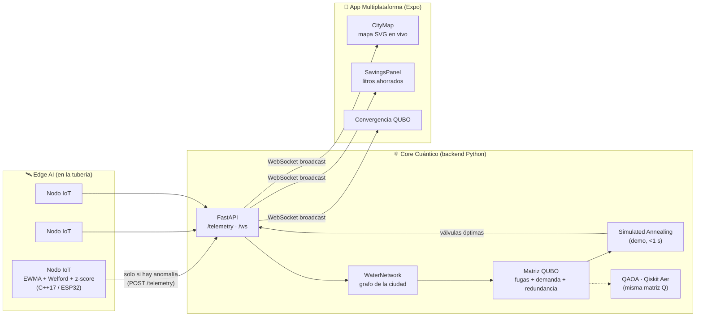

# 🏗️ Arquitectura — QuantumFlow Edge



## Flujo de un evento de fuga (≈ 2 segundos end-to-end)

1. **Detección (t+0 ms):** el sensor de flujo del nodo registra un pico. El detector
   embebido (EWMA contra línea base Welford) calcula z-score > 3.5 → anomalía local.
   *Sin nube, sin latencia de red, sin falsos positivos por ruido del sensor.*
2. **Reporte (t+50 ms):** el nodo envía UN paquete JSON con `pipe_id` y `anomaly_score`.
   El 99.9% del tiempo los nodos no transmiten nada: silencio = salud.
3. **Formulación (t+100 ms):** el backend marca la fuga en el grafo real de Puebla
   (16 sectores + 3 baterías de pozos) y reconstruye la matriz Q (31×31).
   Diagonal = pérdidas por fuga de cada tubería; términos cruzados = restricciones
   de cobertura de demanda y redundancia.
4. **Optimización (t+100→900 ms):** el solver explora el espacio de 2³¹ configuraciones
   de válvulas y encuentra la de mínima energía: aislar la fuga SIN dejar colonias sin
   agua (invariante verificado por aserción en CI). El evento queda en `events.jsonl`.
5. **Actuación (t+1 s):** broadcast por WebSocket. En producción ese mismo mensaje
   abriría/cerraría válvulas motorizadas; en la demo reconfigura el mapa en vivo.

## Decisiones de diseño

| Decisión | Por qué |
|---|---|
| Detección en el nodo, no en el servidor | Ancho de banda ~0, opera sin internet, escala a miles de nodos |
| QUBO agnóstico al solver | La misma matriz Q corre en SA local, QAOA simulado o una QPU real (D-Wave/IBM) sin reescribir nada |
| Penalizaciones λ en vez de restricciones duras | Forma estándar QUBO: compatible con cualquier annealer |
| SA como solver por defecto en demo | Determinista y <1 s: una demo en vivo jamás debe depender de la cola de una QPU |
| WebSocket único hacia todas las pantallas | Teléfono del operador, tablet y videowall ven EXACTAMENTE el mismo estado al mismo tiempo |
| Modo demo embebido en la app | La versión online (GitHub Pages) funciona sin backend: el link se comparte con jueces |
| Solver QUBO portado al cliente (TS 1:1) | El gemelo digital no finge: web y APK resuelven la MISMA matriz Q con el MISMO SA en el dispositivo; paridad TS↔Python verificada en CI |

## Esquemas de datos (contrato entre capas)

**Nodo → Backend** (`POST /telemetry`):
```json
{ "node_id": 4, "pipe_id": 4, "flow_lps": 34.2, "pressure_bar": 2.4,
  "anomaly_score": 4.8, "is_anomaly": true }
```

**Backend → App** (WebSocket, tipo `optimization`):
```json
{ "type": "optimization",
  "data": { "backend": "sa", "open_pipes": [0,1,2,5], "energy": -676.5,
            "convergence_trace": [...], "liters_per_sec_saved": 61.2,
            "solve_time_ms": 827.0, "num_qubits": 32 },
  "network": { "nodes": [...], "pipes": [...] },
  "total_liters_saved": 157.4 }
```
